# AI Resume Screening System (MVP)

An end-to-end resume screening prototype that combines ATS-style keyword filtering with LLM-based candidate evaluation and role-wise ranking.

## Overview

This project provides two user flows in a single Streamlit app:

- **Candidate flow**: upload a PDF resume, run ATS screening, and receive an evaluation status.
- **Company flow**: view role-wise candidates, ranked by quality signals.

The pipeline is:

1. Parse PDF resume text
2. Clean and normalize text
3. Compute ATS score against role requirements
4. Evaluate with LLM (local Ollama model)
5. Persist result to JSON storage
6. Rank and display candidates in the dashboard

## Tech Stack

- **Language**: Python
- **UI**: Streamlit
- **PDF Parsing**: PyMuPDF (`fitz`)
- **LLM Evaluation**: Ollama HTTP API (`llama3.1`)
- **Prompting**: Template-based prompt file (`prompts/evaluation_prompt.txt`)
- **Storage**: File-based JSON (`data/results/*.json`)
- **Utilities**: `python-dotenv`, `requests`, `uuid`, `hashlib`, `re`

## Project Structure

```text
.
├── app.py
├── requirements.txt
├── generate_dummies.py
├── prompts/
│   └── evaluation_prompt.txt
├── modules/
│   ├── parser.py
│   ├── cleaner.py
│   ├── ats.py
│   ├── evaluator.py
│   ├── ranker.py
│   └── storage.py
└── data/
    ├── companies.json
    ├── roles.json
    └── results/
```

## Core Features

- Resume upload and text extraction from PDF files
- ATS scoring using role-specific keyword requirements
- Deterministic LLM evaluation (`temperature = 0`)
- Culture/value-aware scoring context per company
- Candidate ranking by `llm_score`, then `ats_score`
- Duplicate resume handling via deterministic `candidate_id` hashing

## Prerequisites

- Python 3.9+ (recommended)
- Ollama installed and running locally
- `llama3.1` model available in Ollama

Example Ollama setup:

```bash
ollama pull llama3.1
ollama serve
```

## Installation

1. Clone or download this project.
2. Create and activate a virtual environment.
3. Install dependencies.

```bash
pip install -r requirements.txt
```

## Configuration

The project includes `.env` support via `python-dotenv`, but the current evaluator is configured to call:

- `http://localhost:11434/api/generate`

If you change host/model behavior, update `modules/evaluator.py` accordingly.

## Run the Application

```bash
streamlit run app.py
```

Then open the local URL shown in terminal (usually `http://localhost:8501`).

## Usage

### Candidate View

1. Select a role.
2. Upload a PDF resume.
3. Click **Submit Application**.
4. Review ATS score and final status:
   - **Rejected** if ATS < 40
   - **Under Review** or **Shortlisted** after LLM evaluation

### Company View

1. Select a role.
2. Review ranked candidates.
3. Expand each candidate row to inspect:
   - Alignment score
   - Strengths
   - Weaknesses
   - Reasoning

## Data and Results

- Role and company metadata:
  - `data/roles.json`
  - `data/companies.json`
- Candidate outputs are saved per role:
  - `data/results/<role_id>.json`

### Generate Dummy Candidate Results

```bash
python generate_dummies.py
```

This populates `data/results/` with sample candidates for demo/testing.

## Scoring Logic

- **ATS score**: percent of role requirement keywords found in resume text
- **LLM score**: model-generated score out of 25
- **Ranking**: descending by `llm_score`, then `ats_score`

## Known Limitations

- Basic keyword ATS matching (no semantic matching yet)
- Local file-based storage (not suitable for concurrent production use)
- LLM dependency on a running local Ollama instance
- Dependency mismatch risk: `requests` is used in code and should remain installed

## Troubleshooting

- **`Connection refused` from evaluator**: ensure Ollama is running on `localhost:11434`
- **No LLM result**: verify `llama3.1` model is pulled and available
- **PDF extraction empty**: test with another PDF (some scanned PDFs require OCR)
- **No candidates in Company view**: submit candidates first or run `generate_dummies.py`

## Evaluation Metrics & Graphs

Visual analytics generated from the candidate pipeline are stored in `results/metrics/`. Below are the key performance and analytical indicators automatically tracked by the system:

### 1. Resume Screening Metrics
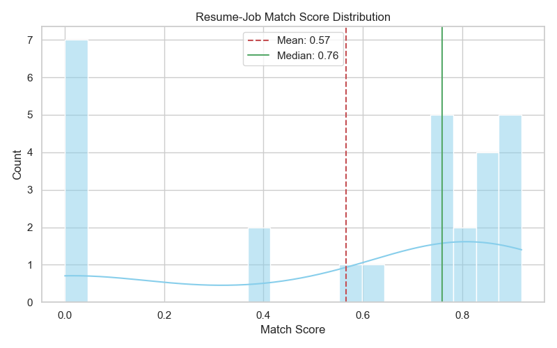
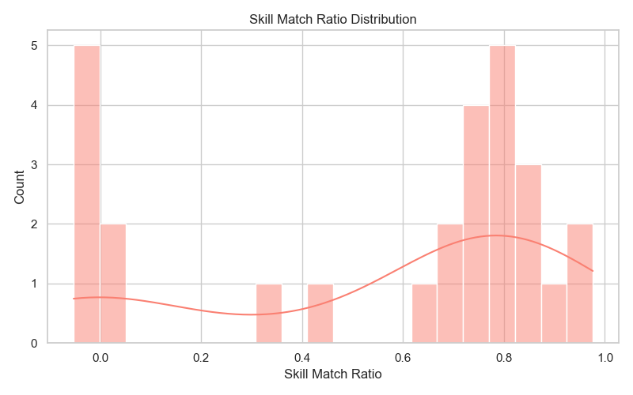
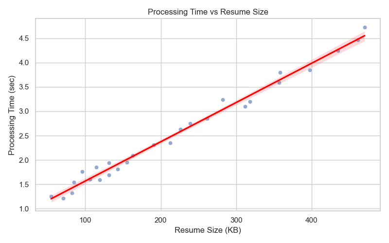

### 2. LLM Evaluation Metrics
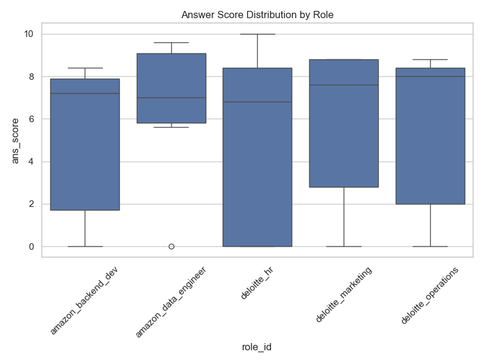
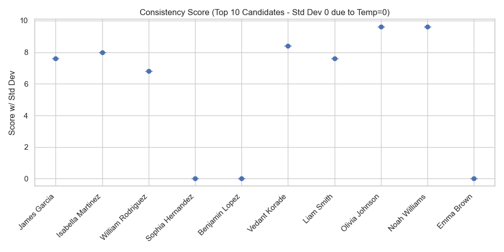
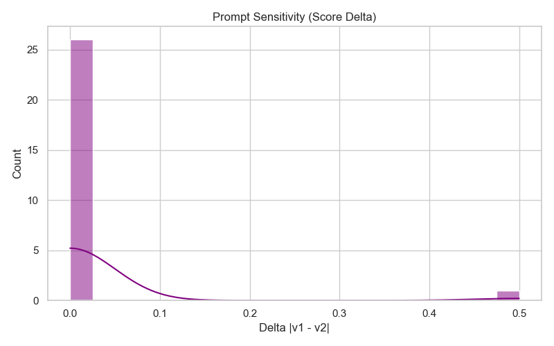

### 3. System-Level Ranking Quality
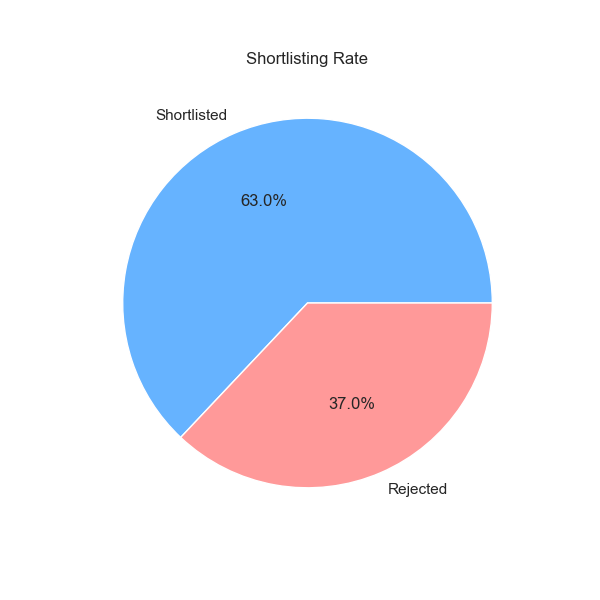
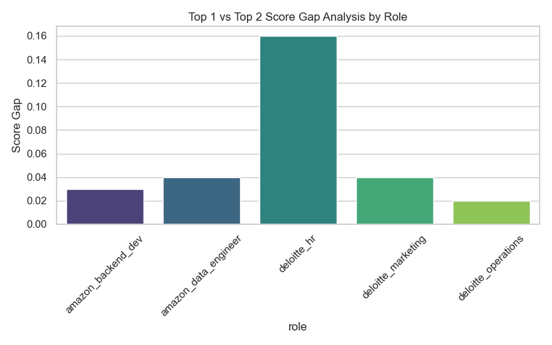

### 4. AI vs Human Alignment
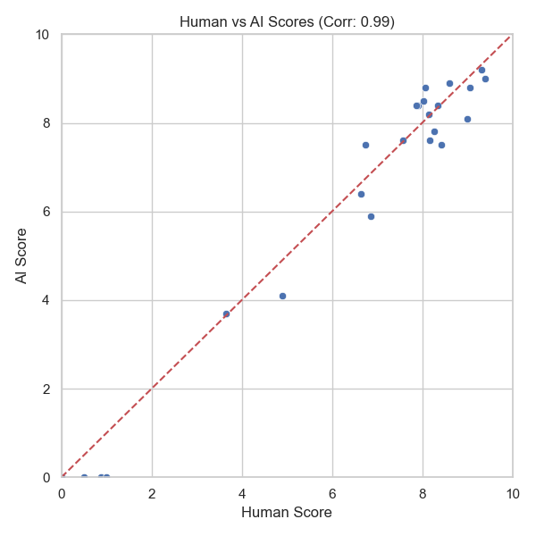

### 5. Advanced Pipeline Analytics
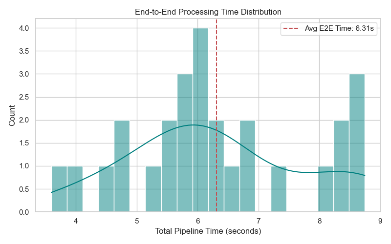
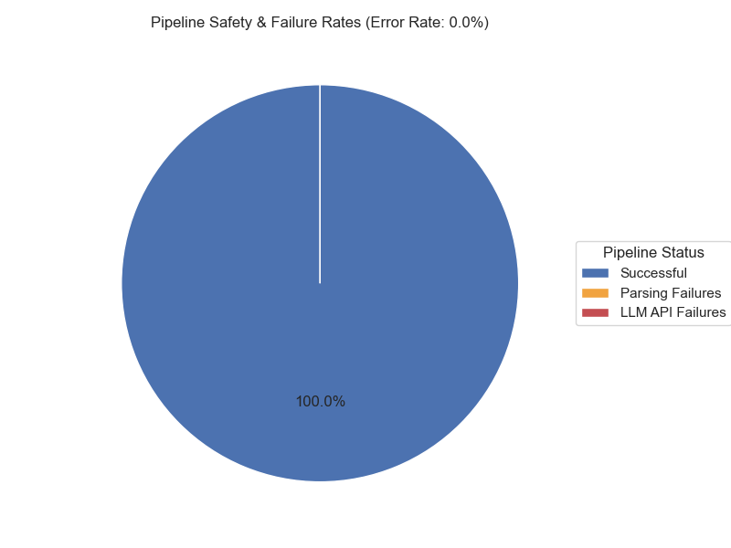
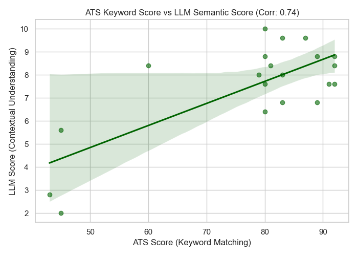
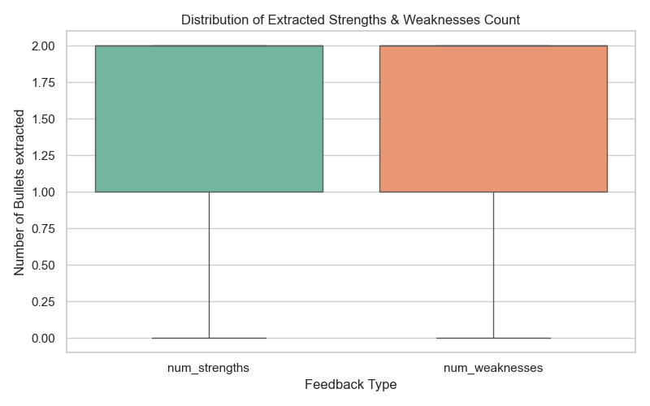

## Roadmap

- Semantic ATS scoring (embeddings-based matching)
- Retry/fallback handling for malformed LLM responses
- Persistent database backend (SQLite/PostgreSQL)
- Authentication and role-based access for company users
- Automated tests and CI pipeline

## 🔮 Future Scope of the Project

### 1. Scalability & Production Deployment
Right now the system is a single-user, local, JSON-based prototype.
Future improvements:
- Replace JSON storage with PostgreSQL / MongoDB
- Deploy on AWS / GCP (Docker + Kubernetes)
- Convert Streamlit app into full-stack web app (React + FastAPI)
- Handle thousands of resumes simultaneously

**Goal:** Making the system scalable and cloud-deployable for enterprise use.

### 2. Advanced LLM Integration
Currently using Ollama + Llama 3.1 locally, which is good but limited.
Future upgrades path (Local &rarr; API-based &rarr; Fine-tuned internal model):
- Use fine-tuned LLMs for recruitment-specific evaluation
- Add RAG (Retrieval-Augmented Generation) for job-specific context and company policies
- Multi-model evaluation (compare outputs for reliability)

### 3. Smarter Resume Understanding
Currently using rule-based + basic NLP parsing.
Future:
- Use NER models (SpaCy / Transformers) for skill extraction and experience classification
- Semantic matching using SBERT / embeddings instead of keyword matching
- Detect fake experience and skill inflation

### 4. AI Interview System (Major Expansion)
Future upgrades focusing on real-time capabilities (e.g. leveraging LiveKit):
- Real-time Speech-to-text (Whisper) and emotion detection (tone, hesitation)
- Dynamic questioning: Next question depends on previous answer
- Behavioral analysis: Confidence scoring and communication clarity

### 5. Advanced Proctoring System
For future advanced proctoring and monitoring setup:
- Eye tracking (attention detection)
- Multi-face detection (cheating)
- Voice anomaly detection
- Tab-switch + window tracking
- Suspicious behavior scoring
*(Note: Full-proof proctoring is extremely difficult; the aim is for probabilistic detection)*

### 6. Bias Reduction & Fairness
A high-value research extension to ensure fairness:
- Remove bias based on factors like Name, Gender, College
- Explainable AI: Transparency on why a candidate was rejected/selected
- Add Fairness metrics and Transparency reports

### 7. Explainable AI Dashboard
Expanding from simple scores to full reasoning:
- *Candidate selected because:* 
  Skill match: 82% | Experience relevance: High | Interview score: 7.5/10

### 8. Integration with Real Hiring Systems
Future integrations directly with:
- ATS (Applicant Tracking Systems)
- LinkedIn / job portals
- HR dashboards

### 9. Autonomous Hiring Assistant (Long-Term Vision)
The end goal of a fully automated AI recruiter that:
- Screens resumes
- Conducts interviews
- Evaluates candidates
- Recommends hiring decisions (with human-in-the-loop approval)

### 10. Research-Level Extensions
For potential paper-level work extensions:
- Multi-modal AI (text + video + audio)
- Confidence calibration of LLM decisions
- Hallucination reduction in evaluation
- Comparative study: Human vs AI recruiter decisions

## License

No license file is currently defined. Add a `LICENSE` file if distribution is planned.
