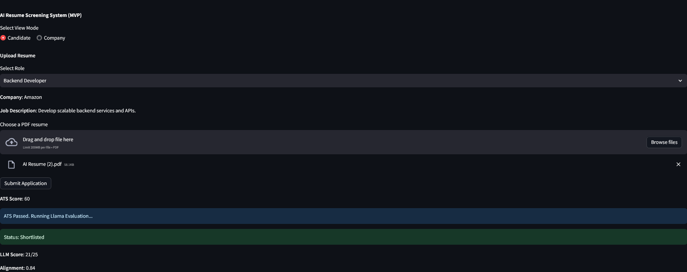
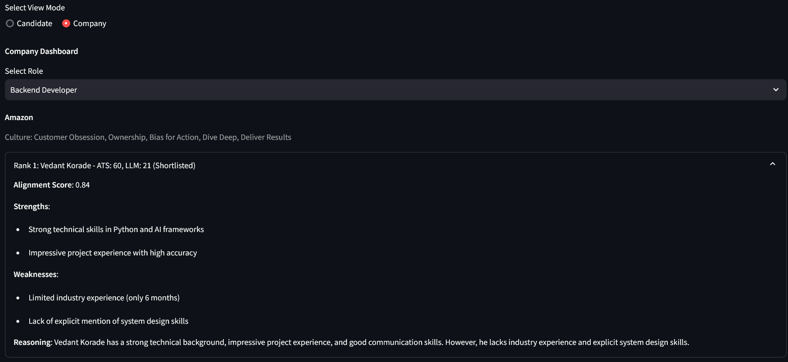
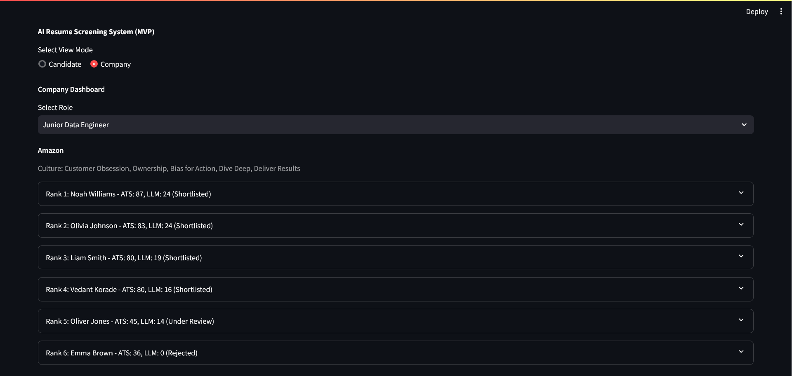

# AI Resume Screening System (MVP)

An end-to-end resume screening prototype that combines ATS-style keyword filtering with LLM-based candidate evaluation and role-wise ranking.

## Overview

This project provides two user flows in a single Streamlit app:

- **Candidate flow**: upload a PDF resume, run ATS screening, and receive an evaluation status.
- **Company flow**: view role-wise candidates, ranked by quality signals.

The pipeline is:

1. Parse PDF resume text
2. Clean and normalize text
3. Compute ATS score against role requirements
4. Evaluate with LLM (local Ollama model)
5. Persist result to JSON storage
6. Rank and display candidates in the dashboard

## Tech Stack

- **Language**: Python
- **UI**: Streamlit
- **PDF Parsing**: PyMuPDF (`fitz`)
- **LLM Evaluation**: Ollama HTTP API (`llama3.1`)
- **Prompting**: Template-based prompt file (`prompts/evaluation_prompt.txt`)
- **Storage**: File-based JSON (`data/results/*.json`)
- **Utilities**: `python-dotenv`, `requests`, `uuid`, `hashlib`, `re`

## Project Structure

```text
.
├── app.py
├── requirements.txt
├── generate_dummies.py
├── prompts/
│   └── evaluation_prompt.txt
├── modules/
│   ├── parser.py
│   ├── cleaner.py
│   ├── ats.py
│   ├── evaluator.py
│   ├── ranker.py
│   └── storage.py
├── images/
│   ├── 1.png
│   ├── 2.png
│   └── 3.png
└── data/
    ├── companies.json
    ├── roles.json
    └── results/
```

## Core Features

- Resume upload and text extraction from PDF files
- ATS scoring using role-specific keyword requirements
- Deterministic LLM evaluation (`temperature = 0`)
- Culture/value-aware scoring context per company
- Candidate ranking by `llm_score`, then `ats_score`
- Duplicate resume handling via deterministic `candidate_id` hashing

## Prerequisites

- Python 3.9+ (recommended)
- Ollama installed and running locally
- `llama3.1` model available in Ollama

Example Ollama setup:

```bash
ollama pull llama3.1
ollama serve
```

## Installation

1. Clone or download this project.
2. Create and activate a virtual environment.
3. Install dependencies.

```bash
pip install -r requirements.txt
```

## Configuration

The project includes `.env` support via `python-dotenv`, but the current evaluator is configured to call:

- `http://localhost:11434/api/generate`

If you change host/model behavior, update `modules/evaluator.py` accordingly.

## Run the Application

```bash
streamlit run app.py
```

Then open the local URL shown in terminal (usually `http://localhost:8501`).

## MVP Screenshots

Store application screenshots in the `images/` folder using these exact names:

- `images/1.png` (home or mode selection)
- `images/2.png` (candidate flow)
- `images/3.png` (company dashboard/ranking view)





## Usage

### Candidate View

1. Select a role.
2. Upload a PDF resume.
3. Click **Submit Application**.
4. Review ATS score and final status:
   - **Rejected** if ATS < 40
   - **Under Review** or **Shortlisted** after LLM evaluation

### Company View

1. Select a role.
2. Review ranked candidates.
3. Expand each candidate row to inspect:
   - Alignment score
   - Strengths
   - Weaknesses
   - Reasoning

## Data and Results

- Role and company metadata:
  - `data/roles.json`
  - `data/companies.json`
- Candidate outputs are saved per role:
  - `data/results/<role_id>.json`

### Generate Dummy Candidate Results

```bash
python generate_dummies.py
```

This populates `data/results/` with sample candidates for demo/testing.

## Scoring Logic

- **ATS score**: percent of role requirement keywords found in resume text
- **LLM score**: model-generated score out of 25
- **Ranking**: descending by `llm_score`, then `ats_score`

## Known Limitations

- Basic keyword ATS matching (no semantic matching yet)
- Local file-based storage (not suitable for concurrent production use)
- LLM dependency on a running local Ollama instance
- Dependency mismatch risk: `requests` is used in code and should remain installed

## Troubleshooting

- **`Connection refused` from evaluator**: ensure Ollama is running on `localhost:11434`
- **No LLM result**: verify `llama3.1` model is pulled and available
- **PDF extraction empty**: test with another PDF (some scanned PDFs require OCR)
- **No candidates in Company view**: submit candidates first or run `generate_dummies.py`

## Roadmap

- Semantic ATS scoring (embeddings-based matching)
- Retry/fallback handling for malformed LLM responses
- Persistent database backend (SQLite/PostgreSQL)
- Authentication and role-based access for company users
- Automated tests and CI pipeline

## License

No license file is currently defined. Add a `LICENSE` file if distribution is planned.
